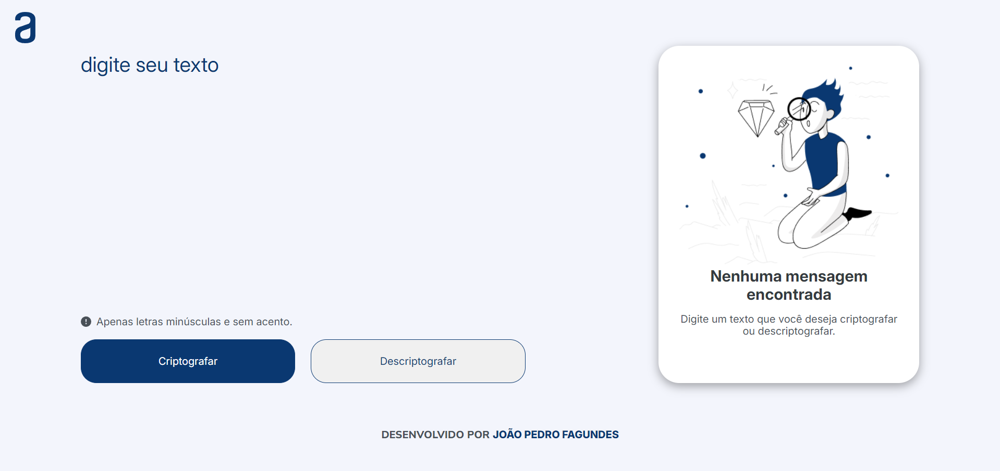

<h1 align="center">  🌟 Challenge Alura 🌟 </h1>

## 📝 Descrição

Projeto de criptografia e descriptografia desenvolvido para o desafio da Alura. Utiliza HTML, CSS e JavaScript para fornecer uma interface simples e intuitiva.

## Deploy 

- <a>https://decoder-jp.netlify.app/ <a/>

## ⚙️ Funcionalidades

- 🔐 Criptografar texto.
- 🔓 Descriptografar texto.
- 🔄 Copiar o texto criptografado.

## 💻 Tecnologias Utilizadas

- HTML
- CSS
- JavaScript

### Autor

- [@felipeborges2](https://github.com/felipeBorges2)

### Contato

- [Email] feehborges02@gmail.com

[

### 🔗 Link do Figma

O projeto da landing page está disponível <a href="https://www.figma.com/design/tvFEYhVfZTjdJ5P24RGV21/Alura-Challenge---Desafio-1---L%C3%B3gica?node-id=0-1" target="blank">aqui</a>.

<h3 align="center">Desenvolvido por Carlos Felipe Borges.</h3>

